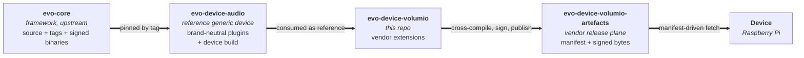

# evo-device-volumio

> Vendor extensions for Volumio on top of [evo-device-audio](https://github.com/foonerd/evo-device-audio), the reference generic audio device. Dormant until the first Volumio-specific plugin or branding work lands.

Stock the plugins. Sign the pieces. The device composes.

A typo in an ALSA parameter is a one-line config edit, not a redeploy. A bug in playback is a one-plugin rebuild, not a firmware flash. A core bump is a deliberate act, not a surprise. This repository is what makes that possible for Volumio's own additions to the reference audio device.

## How it fits together

Four repositories, one flow. `evo-core` ships source and tags. `evo-device-audio` is the reference generic device — brand-neutral audio plugins under `org.evoframework.*` plus the device build that links them. This repository extends that reference with Volumio-specific plugins (`com.volumio.*`), branding, and any divergent UI; it signs its own pieces with the vendor key and publishes to its own artefacts repository. Devices admit `org.evoframework.*` plugins from the reference and `com.volumio.*` plugins from here.

The architectural arrangement: framework (evo-core) / reference generic device (evo-device-audio) / vendor distribution (this repo). Each tier has its own release cadence and signing key; the whole stack composes into the device's deployable image.

## Status

**Dormant.** Brand-neutral plumbing (MPD playback, local-tag metadata, local artwork, ALSA composition) lives upstream in [evo-device-audio](https://github.com/foonerd/evo-device-audio) under `org.evoframework.*`. This repository activates when the first vendor-specific plugin or branding work lands. Current candidate: a metadata plugin that integrates with Volumio's existing metadata pipeline.

### Landed

-   Milestone 0 - distribution-process showcase ([SHOWCASE.md](SHOWCASE.md)).
-   Milestone 1 - repository scaffolding (Cargo workspace, licence, docs, placeholder directories).
-   Milestone 2 - `catalogue/volumio.toml` declaring 15 racks, 26 shelves, and the track-album relation predicates.
-   Plugin-tier migration - brand-neutral plugins moved to [evo-device-audio](https://github.com/foonerd/evo-device-audio); the commons signing key (public half) is bundled in `keys/` so this distribution can admit `org.evoframework.*` plugins.

### Consumed from evo-device-audio

| Plugin                              | Slot                             |
|-------------------------------------|----------------------------------|
| `org.evoframework.playback.mpd`     | `audio.playback`                 |
| `org.evoframework.metadata.local`   | `metadata.providers`             |
| `org.evoframework.artwork.local`    | `artwork.providers`              |
| `org.evoframework.composition.alsa` | `audio_processing.composition`   |

`evo-core` is pinned at tag `v0.1.9` via `[workspace.dependencies]` in `Cargo.toml`. Bumps are deliberate; see [DEVELOPING.md](DEVELOPING.md) for the procedure.

## Documentation

| If you are... | Read |
|---|---|
| **New to this repository** | [SHOWCASE.md](SHOWCASE.md) - the distribution-process showcase. |
| **Bringing up a Pi from blank Pi OS Lite** | [BUILD.md](BUILD.md) - the step-by-step runbook. |
| **Working on the source tree** | [DEVELOPING.md](DEVELOPING.md) - workspace conventions, build and test commands, pin-upgrade procedure. |
| **Looking at the reference device** | [evo-device-audio](https://github.com/foonerd/evo-device-audio) - brand-neutral audio plugins + device build. |
| **Looking at the framework** | [evo-core](https://github.com/foonerd/evo-core) - upstream framework docs. |

## For distributions that follow

`evo-device-bmw-alpine-900`, `evo-device-acme-player`, whichever vendor distribution comes next: start from [evo-device-audio](https://github.com/foonerd/evo-device-audio) (the reference) and add. The pattern is the same everywhere:

-   A source repo named `evo-device-<vendor>`, an artefacts repo named `evo-device-<vendor>-artefacts`, both owned by the same vendor.
-   The framework pinned by tag at the distribution's discretion (or via the reference device's pinning).
-   Every vendor piece signed with the vendor's key. Brand-neutral pieces consumed from the reference device's release plane and verified with the commons trust root.
-   Devices fetch what each manifest names, on the channel they track.

## Related

-   [foonerd/evo-core](https://github.com/foonerd/evo-core) - the framework.
-   [foonerd/evo-device-audio](https://github.com/foonerd/evo-device-audio) - the reference generic audio device.
-   [foonerd/evo-device-volumio-artefacts](https://github.com/foonerd/evo-device-volumio-artefacts) - the release plane for this vendor distribution.

## License

Apache 2.0. See [LICENSE](LICENSE).
