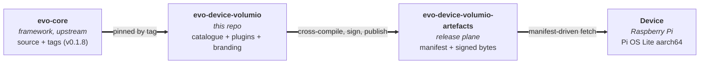
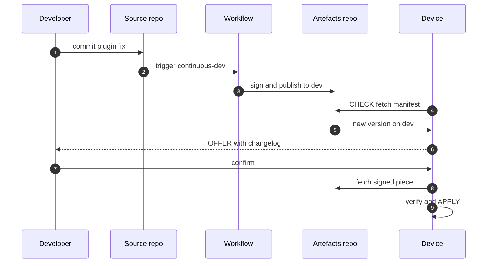

# evo-device-volumio

> The first distribution of [evo-core](https://github.com/foonerd/evo-core). An audio player built as a fabric of independently versioned pieces, not a monolith.

Stock the plugins. Sign the pieces. The device composes.

A typo in an ALSA parameter is a one-line config edit, not a redeploy. A bug in playback is a one-plugin rebuild, not a firmware flash. A core bump is a deliberate act, not a surprise. This repository is what makes that possible for the Volumio-branded audio domain, and - because the evo fabric is domain-neutral - it is also a worked example for every evo distribution that comes after it.

## How it fits together

Three repositories, one flow. `evo-core` ships source and tags only. This distribution pins a tag, cross-compiles the steward and its own plugins, signs every piece with the vendor's key, and publishes to a separate artefacts repository. Devices fetch what the manifest names, on the channel they track. Nothing else crosses the boundary.

## What the device does

Fifteen racks across three concerns. Full charters, kinds, and the mapping of Volumio's existing assets to each rack's role live in [volumio-evo-concept.md](volumio-evo-concept.md) sections 3 and 6.

-   **Domain** - what the product does. `audio`, `audio_sources`, `audio_processing`, `networking`, `storage`, `library`, `artwork`, `metadata`, `branding`, `kiosk`.
-   **Coordination** - when and why it acts. `appointments`, `watches`.
-   **Infrastructure** - how the fabric runs over time. `observability`, `identity`, `lifecycle`.

Each rack holds shelves; plugins stock slots in the shelves; the steward composes the lot. No plugin ever addresses another plugin. Adding a streaming service, a new DAC driver, or a fresh metadata provider is stocking an existing shelf with a new plugin; the rack list does not change.

## How a change reaches a device

One piece replaced. Every other piece - steward, catalogue, other plugins, branding, trust material - untouched. Promoting this version from `dev` to `test` later is a manifest-pointer move, not a rebuild; the bytes on `test` are bit-identical to the bytes already on `dev`.

## Documentation

| If you are... | Read |
|---|---|
| **New to this repository** | [SHOWCASE.md](SHOWCASE.md) - the distribution-process showcase. Why three repos, how pieces flow, what channels are, how a future `evo-device-<brand>` follows the pattern. |
| **Bringing up a Pi from blank Pi OS Lite** | [BUILD.md](BUILD.md) - the step-by-step runbook. Workstation prerequisites, build procedure, first install, update flows, promotion, verification. |
| **Working on the source tree** | [DEVELOPING.md](DEVELOPING.md) - workspace conventions, build and test commands, pin-upgrade procedure. |
| **Learning the domain** | [volumio-evo-concept.md](volumio-evo-concept.md) - the full rack list, plugin mapping, fabric vocabulary specific to Volumio. |
| **Looking at the framework** | [evo-core](https://github.com/foonerd/evo-core) - upstream framework docs (CONCEPT, BOUNDARY, CATALOGUE, SCHEMAS, PLUGIN_AUTHORING, and more). |

## Status

Early. Foundation is complete; Milestone 3 (first plugin) is in progress. The warden now drives a real MPD instance end-to-end; remaining phases add configuration and subject assertion before the first signed release.

**Landed**

-   Milestone 0 - distribution-process showcase ([SHOWCASE.md](SHOWCASE.md)).
-   Milestone 1 - repository scaffolding (Cargo workspace, licence, docs, placeholder directories).
-   Milestone 2 - `catalogue/volumio.toml` declaring 15 racks, 26 shelves, and the track-album relation predicates.
-   [BUILD.md](BUILD.md) - executable runbook, companion to SHOWCASE.
-   `scripts/` - automation skeleton. `bootstrap.sh` (skeleton that completes as later milestones land), `reset.sh` (fully working today), workstation `Makefile` for cross-compiles.

**In progress**

-   Milestone 3 - `com.volumio.playback.mpd` stocking `audio.playback` (first plugin, first real release). Infrastructure layers landing in sequence:
    -   Phase 3.0 - crate skeleton, manifest, stub warden. Landed.
    -   Phase 3.1 - MPD connection layer (protocol stack, status, currentsong). Landed.
    -   Phase 3.2a - transport commands + idle subprotocol on the connection layer. Landed.
    -   Phase 3.2b - playback supervisor module (two-task actor with bounded reconnection and TOML state reports). Landed.
    -   Phase 3.2c - supervisor wired into the warden trait impls; course-correction payload encoding and `PlaybackError` -> `PluginError` classification in place; lint suppressions retired. Landed.
    -   Phase 3.3 - configuration file (`/etc/evo/plugins.d/com.volumio.playback.mpd.toml`). Pending.
    -   Phase 3.4 - subject assertion (`track` + `album` for Milestone 4's respondent to walk). Pending.

**Next**

-   Milestone 4 - `com.volumio.artwork.local` stocking `artwork.providers` (second plugin, first multi-piece composition).

`evo-core` is pinned at tag `v0.1.8` via `[workspace.dependencies]` in `Cargo.toml`. Bumps are deliberate; see [DEVELOPING.md](DEVELOPING.md) for the procedure.

## For distributions that follow

`evo-device-bmw-alpine-900`, `evo-device-acme-player`, whichever distribution comes next reads this repository as a worked example. The pattern is the same everywhere:

-   A source repo named `evo-device-<brand>`, an artefacts repo named `evo-device-<brand>-artefacts`, both owned by the same vendor.
-   The framework pinned by tag at the distribution's discretion.
-   Every piece signed with the vendor's key.
-   Devices fetch what the manifest names, on the channel they track.

[SHOWCASE.md](SHOWCASE.md) is written specifically so the Volumio text reads as a generic pattern once brand-specific nouns are substituted. If a section breaks that test, it belongs somewhere else.

## Related

-   [foonerd/evo-core](https://github.com/foonerd/evo-core) - the framework.
-   [foonerd/evo-device-volumio-artefacts](https://github.com/foonerd/evo-device-volumio-artefacts) - the release plane for this distribution.

## License

Apache 2.0. See [LICENSE](LICENSE).
